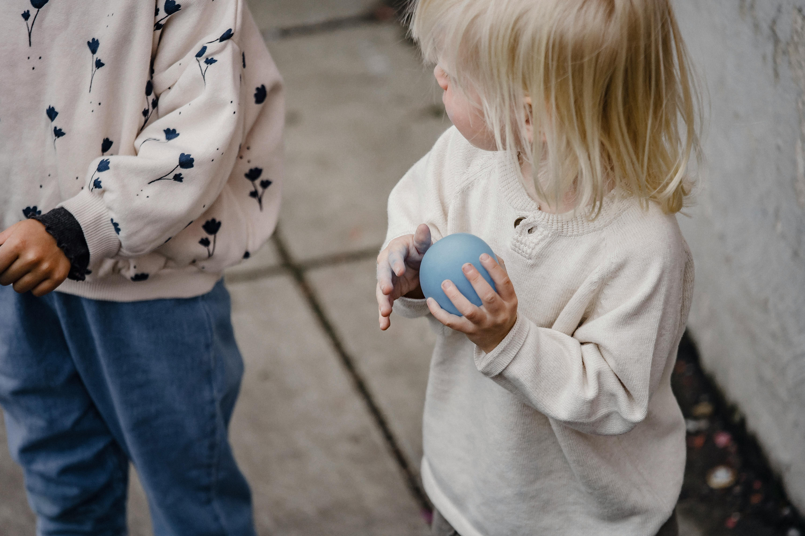
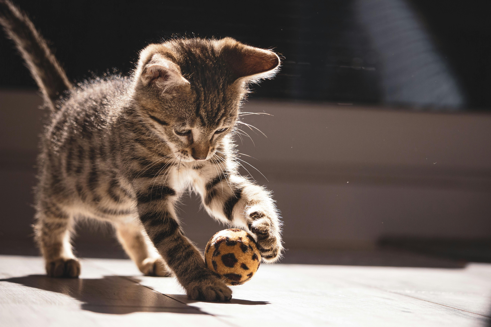
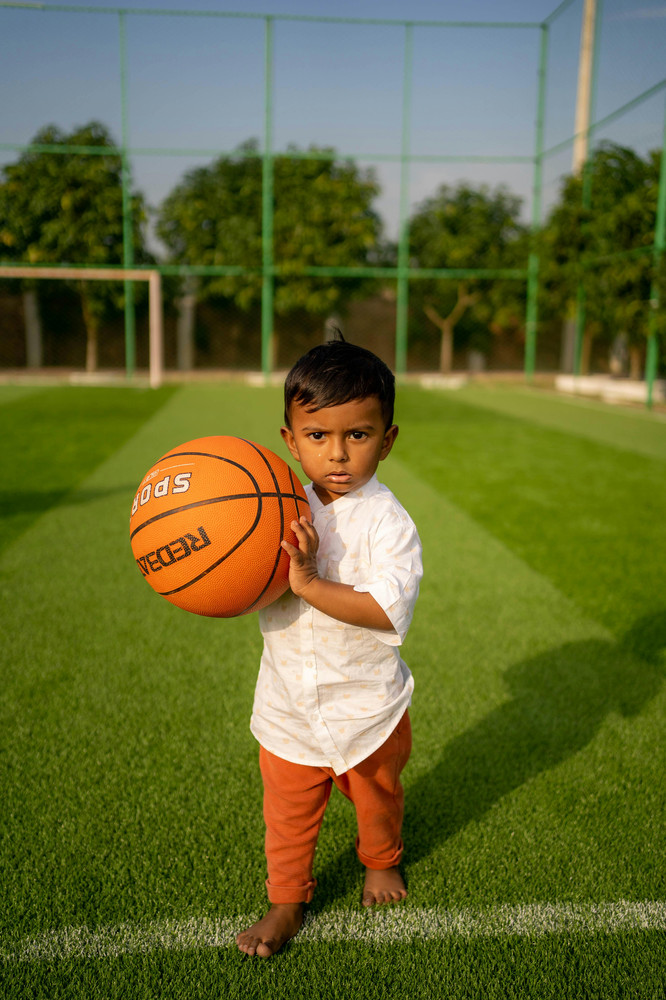

# mumo'o

| .y.                             | .y.                         |
|---------------------------------|-----------------------------|
| le mlatu e le remna cu cmalu    |  |
| .i le zarce e le remna cu cmalu |  |
| .i le remna e le bolci cu cmalu |  |
| .i le mlatu e le bolci cu cmalu |  |

ni'o

| .y.                           | .y.                            |
|-------------------------------|--------------------------------|
| le bolci cu cmalu je narju    |     |
| .i le zarce cu cmalu je blanu |  |
| .i le bolci cu cmalu je blanu |     |
| le mlatu cu cmalu je narju    |     |
| le bolci cu barda je xunre    |     |

ni'o

| .y.                                         | .y.                     |
|---------------------------------------------|-------------------------|
| le mlatu cu cmalu .ije le remna cu cmalu    |   |
| .i le zarce cu cmalu .ije le remna cu cmalu |   |
| .i le remna cu cmalu .ije le bolci cu cmalu |   |
| .i le mlatu cu cmalu .ije le bolci cu cmalu |   |
| .i le mlatu cu cmalu .ije le remna cu barda |  |
| .i le remna cu cmalu .ije le bolci cu barda |  |

ni'o

## se vaivla

* zo e
* e zo je
* e lu .ije 

vau
